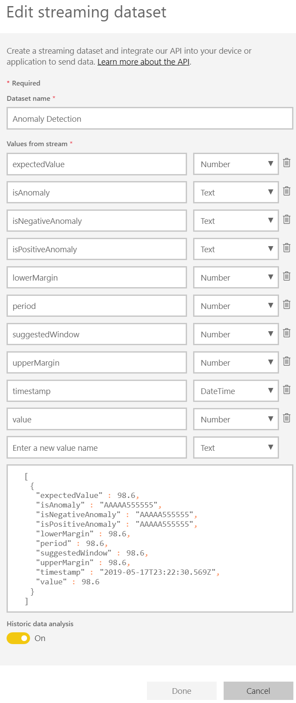

# Anomaly Detector (REST API) - Jupyter notebook
This Jupyter notebook can be used to detect anomalies with the Microsoft Cognitive Service - Anomaly Detector. This is a RESTful web service that can be used easily embed anomaly detection capabilities into your apps so your users can quickly identify problems to minimize loss and customer impact.

The service requires no extensive knowledge about machine learning techniques. The user can simply use the API to ingest time-series data of all types and volumes and make use of the pre-trained AI models that are included in the service. The service selects the best-fitting anomaly detection model for your data to ensure high accuracy, and automatically surfaces incidents as soon as they happen.

Use Anomaly Detector to identify business incidents, monitor IoT device traffic, manage fraud, respond to changing markets, and more.

## Parameters
The parameters can be understood as settings and are adjustable according to your requirements. The variables have the following purpose within the notebook:

* `BATCH_DETECTION_URL`: Endpoint path for the prediction of anomalies for a whole batch of timeseries data. Generally, this value must not be changed by the user.
* `LATEST_POINT_DETECTION_URL`: Endpoint for the prediction of anomalies for the last point in the timeseries data. Generally, this value must not be changed by the user.
* `ENDPOINT`: Endpoint of the Cognitive Service. The Anomaly Detector service can be deployed in different Azure regions and the region in the endpoint URI must be adjusted accordingly. The base URL has the following format, whereas the correct region must be inserted in `<your-region>` (e.g. `westeurope`, `westus2`, etc.): `https://<your-region>.api.cognitive.microsoft.com/`
* `SUBSCRIPTION_KEY`: Insert the subscription key of your Anomaly Detector deployment. This can be found in the Azure Portal. 
* `USE_POWER_BI`: `True`, if you want to stream data to Microosft Power BI and `False`, if you don't. Please read the next section for more details.
* `POWER_BI_REST_API_URL`: Streaming data endpoint for Power BI. Please read the next section for more details.
* `TIMESTAMP_COL_NAME`: Header name of the timestamp column.
* `VALUE_COL_NAME`: Header name of the value column.
* `DATETIME_FORMAT`: Change the value according to your datetime format in the csv file.

## Power BI integration
For the latest point anomaly detection I implemented a data streaming functionality to Power BI. This allows to create real-time dashboards that present the current status of the timseries and allow to quickly view and react according to the results. To use this, please follow steps below:

1. Login to [Power BI](https://powerbi.microsoft.com/en-us/).
2. Open `My Workspace`.
3. Click on `+ Create`.
4. Create a new streaming dataset.
5. Select `API`
6. Select a name for the dataset.
7. Add values to the dataset (see image below). Historic data analysis can be turned on.
8. Select `Create`.
9. Copy the `Push URL` of the streaming dataset and assign the value to the `POWER_BI_REST_API_URL` variable in the Jupyter notebook.
10. Select `Done` on the PowerBI Website.
11. Click on `+ Create`.
12. Create a new dashboard.
13. Choose a name for your new dashboard and select `Create`.
14. Select `+ Add Tile` (In the new PowerBI Frontend the button might be hidden behind the `...` option).
15. Select `Custom Streaming Data` and then `Next`.
16. Now select your streaming dataset and then `Next`.
17. Click on `+ Add value` and select a value of your dataset.
18. Now select `Next` and then `Apply`.
19. Add additional tiles to your dashboard.
9. Set `USE_POWER_BI` to `True` in the Jupyter notebook.
10. Run one of the cells below `6.2 Latest point` in the Jupyter notebook.

## Run Anomaly Detector in local Docker container
The Anomaly Detector Service also supports local deployment in a Docker container. Please follow [this guide](https://docs.microsoft.com/en-us/azure/cognitive-services/anomaly-detector/anomaly-detector-container-howto) to use this functionality. If the local deployment was successful, you can open http://localhost:5000/ to validate whether the Docker image is running. Now you can use either http://localhost:5000/swagger and curl or the notebook in this repository to test the service. If you want to use the notebook, just set the `ENDPOINT` to http://localhost:5000 (`ENDPOINT = "http://localhost:5000"`) and you are good to go.

## Anomaly Detector documentation
Find more details about the use of the Anomaly Detector on the following website: https://docs.microsoft.com/en-us/azure/cognitive-services/anomaly-detector/

For more information on how to deploy the Cognitive Service on Azure, please read: https://docs.microsoft.com/en-us/azure/cognitive-services/cognitive-services-apis-create-account
